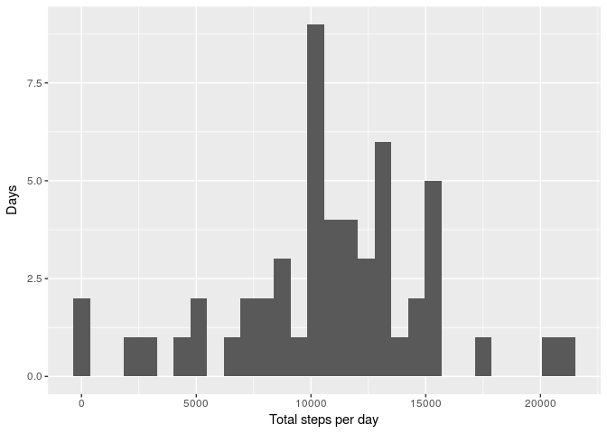
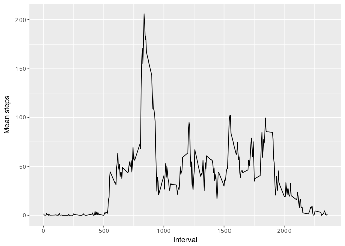
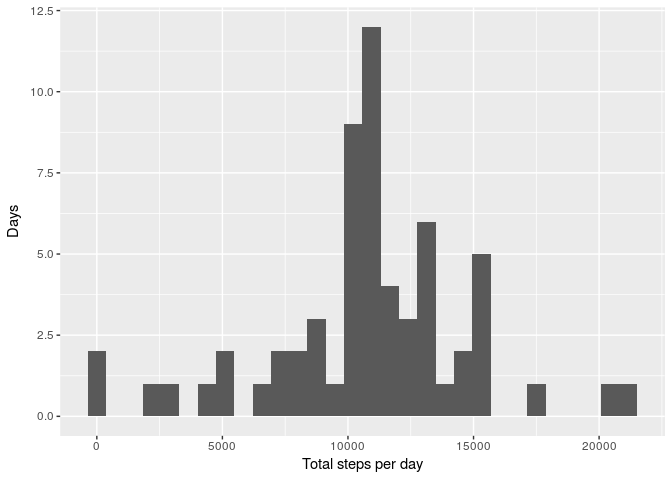
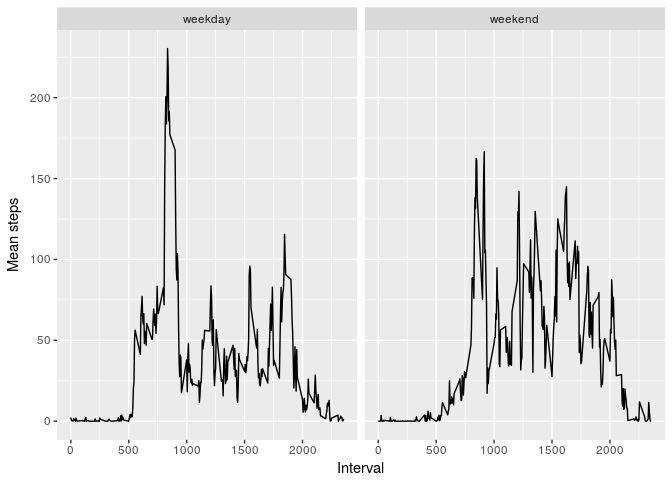

# Load libraries


```r
library(plyr)
library(reshape2)
library(ggplot2)
```

# Loading and preprocessing the data

The variables included in this dataset are:

+ steps: Number of steps taken in a 5-minute interval (missing values are coded as NA)
+ date: The date on which the measurement was taken in YYYY-MM-DD format
+ interval: Identifier for the 5-minute interval in which measurement was taken

The dataset is stored in a comma-separated-value (CSV) file, and there are a total of 17,568 observations in this dataset.

## Code for reading in the dataset and/or processing the data


```r
activity = read.table(unz("activity.zip", "activity.csv"), header=T, sep=",")
summary(activity)
```

```
##      steps                date          interval     
##  Min.   :  0.00   2012-10-01:  288   Min.   :   0.0  
##  1st Qu.:  0.00   2012-10-02:  288   1st Qu.: 588.8  
##  Median :  0.00   2012-10-03:  288   Median :1177.5  
##  Mean   : 37.38   2012-10-04:  288   Mean   :1177.5  
##  3rd Qu.: 12.00   2012-10-05:  288   3rd Qu.:1766.2  
##  Max.   :806.00   2012-10-06:  288   Max.   :2355.0  
##  NA's   :2304     (Other)   :15840
```

# What is mean total number of steps taken per day?

For this part of the assignment, you can ignore the missing values in the dataset.

## Total number of steps taken per day


```r
activity_total = ddply(activity,.(date),summarise,Total=sum(steps))
```

## Histogram of the total number of steps taken each day


```r
ggplot(activity_total,aes(x=Total)) + geom_histogram() + xlab("Total steps per day") + ylab("Days")
```

```
## `stat_bin()` using `bins = 30`. Pick better value with `binwidth`.
```

```
## Warning: Removed 8 rows containing non-finite values (stat_bin).
```

<!-- -->

## Mean and median total number of steps taken each day


```r
ddply(activity_total,.(), summarise,Median=median(na.omit(Total)),Mean=mean(na.omit(Total)))[2:3]
```

```
##   Median     Mean
## 1  10765 10766.19
```

# What is the average daily activity pattern?

## Time series plot of the average number of steps taken

Make a time series plot (i.e. type="l") of the 5-minute interval (x-axis) and the average number of steps taken, averaged across all days (y-axis)


```r
activity_interval = ddply(activity,.(interval),summarise,Steps=mean(na.omit(steps)))
ggplot(activity_interval,aes(x=interval,y=Steps)) + geom_line() + xlab("Interval") + ylab("Mean steps")
```

<!-- -->

## The 5-minute interval that, on average across all the days in the dataset, contains the maximum number of steps


```r
activity_interval[which.max(activity_interval$Steps),]
```

```
##     interval    Steps
## 104      835 206.1698
```

# Imputing missing values

Note that there are a number of days/intervals where there are missing values (coded as NA). The presence of missing days may introduce bias into some calculations or summaries of the data.

## Code to describe and show a strategy for imputing missing data

Calculate and report the total number of missing values in the dataset (i.e. the total number of rows with NAs)


```r
dim(activity[which(is.na(activity$steps)),])[1]
```

```
## [1] 2304
```

Devise a strategy for filling in all of the missing values in the dataset. The strategy does not need to be sophisticated. For example, you could use the mean/median for that day, or the mean for that 5-minute interval, etc.

Create a new dataset that is equal to the original dataset but with the missing data filled in.


```r
activity_impute = merge(activity,activity_interval,all.x=TRUE,by="interval")
activity_impute$steps = ifelse(is.na(activity_impute$steps),activity_impute$Steps,activity_impute$steps)
activity_impute = activity_impute[1:3]
```

## Histogram of the total number of steps taken each day after missing values are imputed

Make a histogram of the total number of steps taken each day and Calculate and report the mean and median total number of steps taken per day. Do these values differ from the estimates from the first part of the assignment? What is the impact of imputing missing data on the estimates of the total daily number of steps?


```r
activity_impute_total = ddply(activity_impute,.(date),summarise,Total=sum(steps))
ggplot(activity_impute_total,aes(x=Total)) + geom_histogram() + xlab("Total steps per day") + ylab("Days")
```

```
## `stat_bin()` using `bins = 30`. Pick better value with `binwidth`.
```

<!-- -->

```r
ddply(activity_impute_total,.(), summarise,Median=median(na.omit(Total)),Mean=mean(na.omit(Total)))[2:3]
```

```
##     Median     Mean
## 1 10766.19 10766.19
```

Imputing data slightly increases the median total number of steps per day, although the mean remains unchanged. 

# Are there differences in activity patterns between weekdays and weekends?

Use the dataset with the filled-in missing values for this part. Create a new factor variable in the dataset with two levels – “weekday” and “weekend” indicating whether a given date is a weekday or weekend day.

Make a panel plot containing a time series plot (i.e. type="l") of the 5-minute interval (x-axis) and the average number of steps taken, averaged across all weekday days or weekend days (y-axis). See the README file in the GitHub repository to see an example of what this plot should look like using simulated data.

## Panel plot comparing the average number of steps taken per 5-minute interval across weekdays and weekends


```r
activity_impute$Weekday = factor(ifelse(weekdays(as.Date(activity_impute$date)) %in% c("Saturday","Sunday"),"weekend","weekday"),levels=c("weekday","weekend"))

activity_impute_interval = ddply(activity_impute,.(interval,Weekday),summarise,Steps=mean(na.omit(steps)))
ggplot(activity_impute_interval,aes(x=interval,y=Steps)) + geom_line() + facet_wrap(~Weekday) + xlab("Interval") + ylab("Mean steps")
```

<!-- -->

Activity begins more gradually on weekends and does not include an interval of particularly high activity in the morning. 
